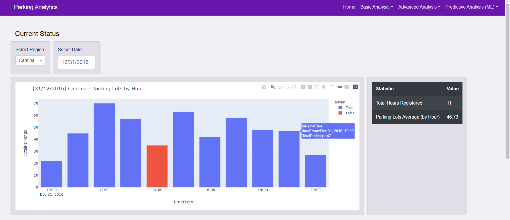
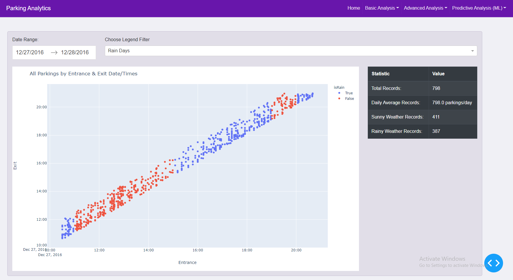
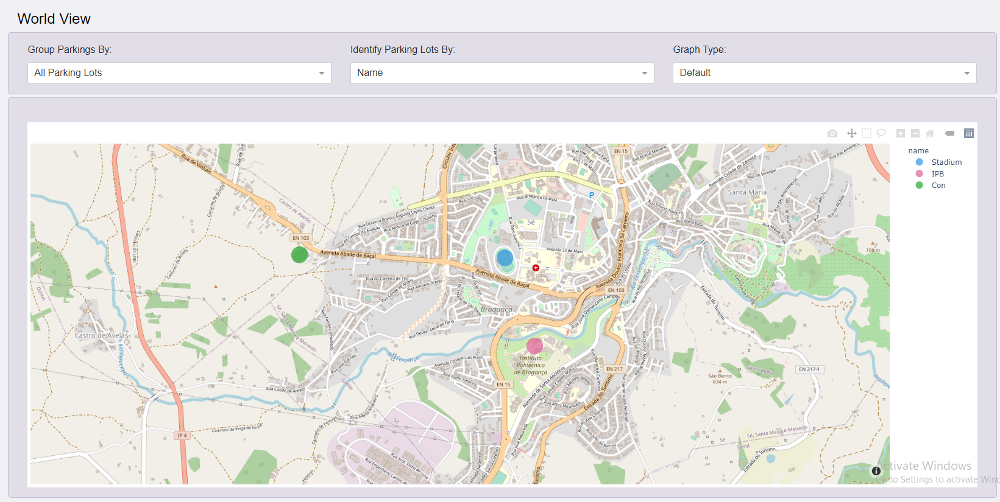
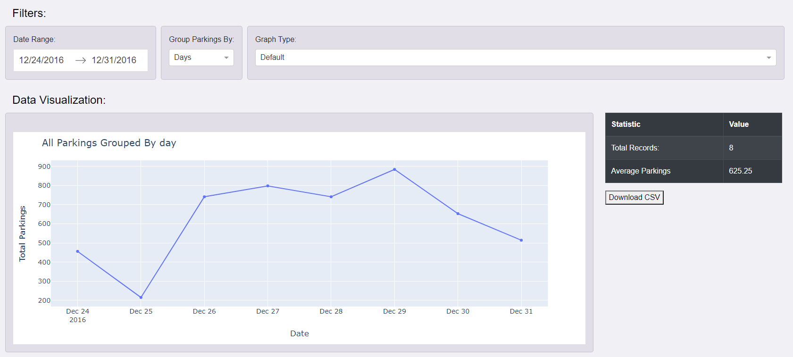

## Smart Parking Data Analytics Dashboard

A complete panel for data analysis based on Smart Parking data.  

This application runs with data made by Smart Parking Data Simulator project.  
<a href="https://github.com/lrmendes/SmartParking-Data-Simulator" target="_blank">Click here</a> to access the Data Simulator.

You can simulate any kind of parking and use this dashboard to visualize and make predictions based on your own generated parking data.

### Technologies (Python)

- Dash 
- Pandas
- Plotly
- _TensorFlow (soon)_

### Features
- Data Preparation (Custom Dataframe for each graph)
- Data Visualization (Different kinds of graphs)
- _Machine Learning Visualization (Forecasting) (soon)_

### Interfaces

- ##### Home Page

---------------

- ##### Daily Parkings

---------------

- ##### World Map Graph

---------------

- ##### Total Parkings

